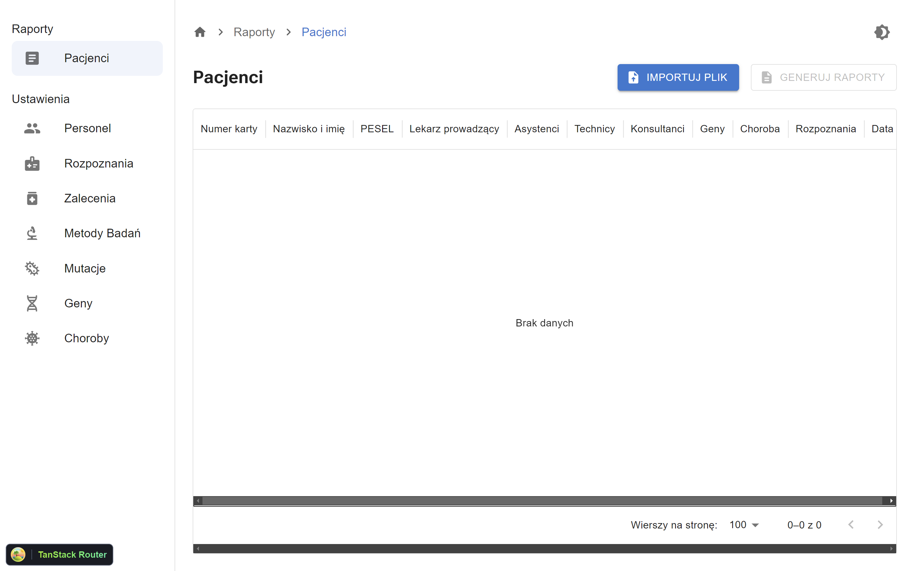
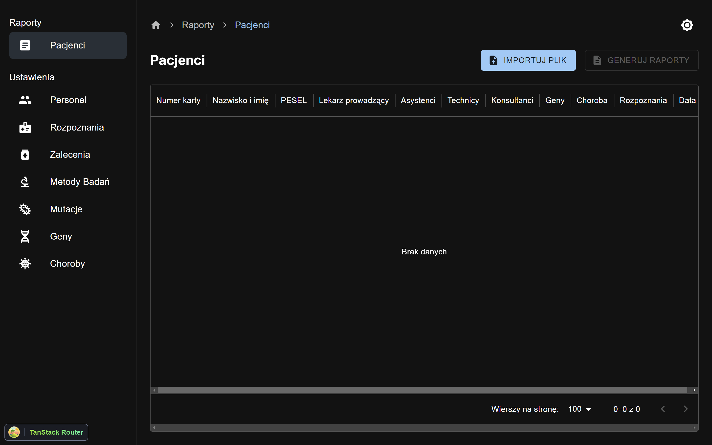

# Diagnosis Report Generator




## 👀 Overview

This is a electron app that generates a diagnosis report for a patient.
The app is built using React and Electron.

## 🛫 Quick Setup

```sh
# clone the project
git clone https://github.com/ThomasKiljanczykDev/DiagnosisReportGenerator

# enter the project directory
cd js/electron-app

# install dependency
yarn install

# develop
yarn dev
```
